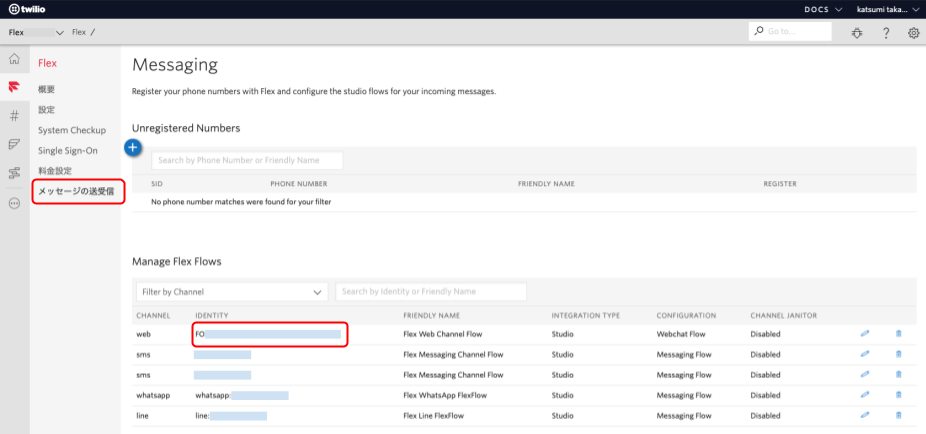

# Twilio Flex WebChat UI for Japanese

This project is how to customize Twilio Flex WebChat UI Japanese locale.
Twilio Flex WebChat UI を日本語化します。


## 準備

- Twilio CLI
- CLI Serverless Plugins

また、Twilio Flex がセットアップされている必要があります。

このプログラムをセットアップには、以下の 2 つの情報が必要です。

- Twilio Account Sid: Twilio のアカウント SID（AC から始まる文字列）
- Twilio AuthToken: アカウント SID とセットで使う AuthToken
- Twilio Flex Flow Sid: WebChat 用の Twilio Flex Flow Sid（FO から始まる文字列）

Flex Flow Sid は、以下の場所を確認してください。

- Flex プロジェクトの管理コンソールにログインします。
- Flex メニューを選択し、さらに**メッセージの送受信**を選択します。
- **web**チャンネルの**IDENTITY**に表示されている FO から始まる文字列が Flow Sid です。



## インストール

```sh
git clone https://github.com/mobiliebiz/flex-webchat-ja.git
cd flex-webchat-ja
npm install
cp .env.sample .env
```

コピーした.env をエディタで開き、先程調べておいた AccountSid と AuthToken、 FlexFlowSid を更新します。

## ローカルテスト

```sh
npm start
```

ブラウザで
[http://localhost:3000/index.html](http://localhost:3000/index.html)
にアクセスします。

なお、Flex 側も起動しておかないとチャットへの応答ができません。

## デプロイ

```sh
twilio serverless:deploy --force
```

## ディレクトリ構造

```sh
.
├── README.md              このファイルです。
├── assets
│   ├── css
│   │   └── style.css
│   ├── i18n.js            プレエンゲージフォームや日本語テンプレートを規定しているファイルです。
│   ├── images
│   ├── index.html         WebChatを表示するHTMLファイルです。
│   └── webchat.js         WebChatを実装するJavaScriptファイルです。
├── .env.sample            環境変数の雛形です。
├── functions
│   └── config.js          環境変数を取得するためのFunctionsです。
├── node_modules
├── package-lock.json
└── package.json
```
